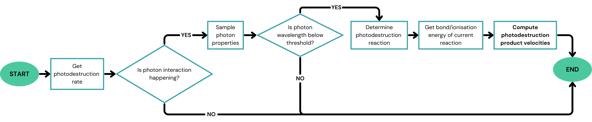
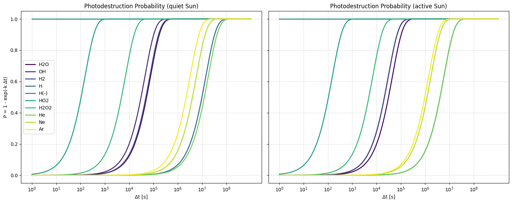
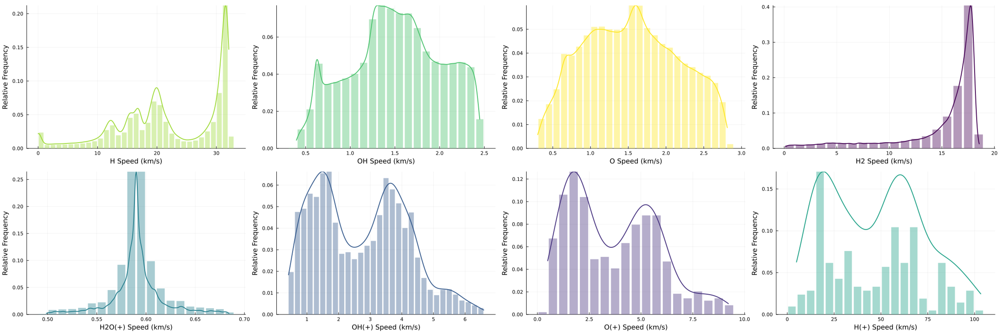

# Summary

[`EXOSPHID`](https://github.com/charligolea/EXOSPHID) (EXOSpheric PHotoIonisation and PhotoDissociation) is a **Julia** [@Julia:2015] scientific code library to simulate photodissociation and photoionisation  processes in extraterrestrial exospheres of our Solar System, with particular focus on lunar applications and hydrogen-bearing species. 

`EXOSPHID` relies on a database of photodestruction mechanisms for exospheric species, together with solar photon flux spectra, which enable it to simulate the corresponding photodissociation and photoionisation processes. Using a particle-based approach, `EXOSPHID` determines the velocities of the daughter species generated in these photon-induced interactions.


# Statement of Need

The 2023 Decadal Strategy for Planetary Science and Astrobiology survey [@OWL] emphasized the fundamental importance of understanding surface–exosphere interactions for advancing knowledge of the Solar System. The survey identified that airless bodies such as the Moon, Mercury, Ceres, and Phobos may exhibit a similarly complex interplay between their surfaces and surrounding exospheres.

Recent observations suggest that trapped nightside particles, like water, may be transported during daylight, creating a potential volatile cycle [@OWL]. However, the apparent lack of a detectable stable water exosphere on the Moon indicates that released water may be rapidly dissociated, ionized, or otherwise destroyed by solar photon irradiation, preventing its transport to polar regions [@Benna:2019]. 

Photochemical loss processes have therefore been a major focus of planetary science for over four decades. Early studies replicated rates and outcomes of photon-induced interactions, particularly in cometary comae and other small bodies [@Festou:1981; @Crovisier:1989; @Combi:2004; @Tenishev:2008]. However, past models are typically limited to specific targets, often neglect the variability of solar activity and may included simplified theoretical frameworks. 

`EXOSPHID` addresses these limitations by providing a flexible and expandable framework for simulating photodissociation and photoionization. By incorporating generalized, extensible photochemical databases for exospheric constituents, species-specific solar irradiation data, and solar activity dependence, the package enables a comprehensive investigation of photon-exosphere interactions throughout the Solar System.


# Main Applications

`EXOSPHID` provides a flexible toolset to model photodestruction reactions, which can be integrated within a larger exospheric modeling framework. One such example is `ExESS` [@exess], a comprehensive numerical framework of the exosphere that simulates the distribution and behaviour of volatile species.  

A preliminary version of `EXOSPHID` was presented in [@GOB:2025], where the package focused on simplified photochemistry for hydrogen-bearing species in the lunar environment ($H_2, OH, H_2O$). This study aimed to validate the performance of `EXOSPHID` against previous models in the literature, including @Festou:1981; @Crovisier:1989; @Combi:2004; @Tenishev:2008.


# Theoretical Background

Solar radiation is the primary energy source driving photochemical processes in space environments. In the ultraviolet (UV) and extreme ultraviolet (EUV) regions, solar photons carry sufficient energy to trigger both photodissociation and photoionization.

Consider a neutral parent molecule AB, where A and B are distinct atomic or molecular constituents. When this molecule absorbs a solar photon ($\gamma$) of energy $h\nu$ (with $h$ being Planck’s constant and $\nu$ the photon frequency), a photodestruction event may be initiated.

**Photodissociation** involves breaking a molecular bond via photon absorption:
$$
AB + h\nu \rightarrow A + B
$$

**Photoionisation** entails the ejection of an electron after photon absorption:
$$
AB + h\nu \rightarrow AB^+ + e^{-}
$$

Both processes liberate excess energy, which is then distributed among the reaction products.

A detailed explanation of the theory behind photodestruction processes, including photodissociation and photoionization, is available in the [EXOSPHID Wiki](https://github.com/charligolea/EXOSPHID/wiki/Validation).

# Key Features

## Flexibility of Solar Activity

Previous models [@Festou:1981; @Crovisier:1989; @Tenishev:2008; @Combi:2004] used a simplified treatment of solar activity to represent variations over the 11-year solar cycle, driven by changes in sunspot number [@Richardson:2001; @Combi:2004]. The two cases commonly used are the quiet Sun, representative of solar minimum, and the active Sun, corresponding to solar maximum, where solar photon flux in the EUV range is roughly 2–3 times higher [@Huebner:1992].

In contrast, `EXOSPHID` enables a continuous treatment of solar radiation, interpolating fluxes at any point within the solar cycle, allowing for more realistic simulations of photodestruction processes under varying solar conditions.


## Photochemical Database

Currently, `EXOSPHID` features a built-in database containing information on photodestruction mechanisms for various exospheric species, including $H$, $H^{-}$, $H_2$, $He$, $OH$, $H_2O$, $Ne$, $HO_2$, $H_2O_2$, $Ar$. The database includes photodestruction pathways, branching ratios, photon absorption cross sections, solar flux distributions, reaction thresholds, photodestruction rates, and energy partitioning including vibrational, rotational, and electronic contributions.


## Featured Photochemical Loss Processes

`EXOSPHID` can simulate five different types of photodestruction events, based on standard cases. These processes, along with their typical reaction examples, are summarized in the table below.

**Table 1: Key Photochemical Loss Processes Simulated by EXOSPHID**

+----------+--------------------------------------------------+----------------------------------+
| Reaction | Description                                      | Example                          |
+==========+==================================================+==================================+
| SPD      | Molecular bond is broken via $\gamma$ absorption | $OH + h\nu → O + H$              |
+----------+--------------------------------------------------+----------------------------------+
| DPD      | Two successive photodissociations occur          | $H_2O + h\nu → O + H + H$        |
+----------+--------------------------------------------------+----------------------------------+
| SPI      | Electron is ejected via $\gamma$ absorption      | $Ar + h\nu → Ar^{+} + e^{-}$     |
+----------+--------------------------------------------------+----------------------------------+
| DPI      | Two successive photoionisations occur            | $H^{-} + h\nu → H^{+} + 2e^{-}$  |
+----------+--------------------------------------------------+----------------------------------+
| DiPI     | $\gamma$ ionizes, then dissociates a molecule    | $H_2 + h\nu → H^{+} + H + e^{-}$ |
+==========+==================================================+==================================+
| PD: Photodissociation, PI: Photoionisation, S..: Single, D..: Double, Di..: Dissociative       |
+==========+==================================================+==================================+

## Expansion of EXOSPHID Species

`EXOSPHID` allows users to extend the photochemical database by incorporating additional species or reaction pathways as needed.  

To do this, a user generally needs to provide:

- **Basic species information**: chemical formula, mass, and relevant parent/daughter species.  
- **Photochemical properties**: wavelength-dependent absorption cross-sections, photodestruction thresholds, branching ratios...  
- **Energy data**: vibro-rotational and electronic energy levels for parent and daughter states.  
- **Solar flux data**: standard and normalized fluxes for quiet and active Sun conditions.  

Detailed instructions and methodology for adding new species are provided in [`EXOSPHID`](https://github.com/charligolea/EXOSPHID/methods/).

# Worflow Overview

`EXOSPHID`’s overall logic is summarized in the flowcharts below:



The probability $p$ of a photodestruction event occurring during a timestep $\Delta t$ is given by:
\begin{equation}\label{eq:probability}
p = 1 - e^{-k \Delta t}
\end{equation}

where $k$ is the photodestruction rate of the parent species. As shown in \autoref{fig:prob}, $p$ increases with $\Delta t$, meaning that for sufficiently large time intervals, a photodestruction event becomes very likely.

{ width=90% }

If an interaction occurs based on \autoref{eq:probability}, a photon energy is sampled and checked against the dissociation threshold. The model then selects a reaction based on branching ratios from the photochemical database, and the final velocities of the products are computed using energy and momentum conservation.


# Example Usage

`photodestruction(solar_activity, dt, parent_type, parent_velocity, sun_tuple, dist_to_sun)` is the main function of the **EXOSPHID** package, responsible for generating the logic behind the simulation of the photon–parent interaction.

```julia
solar_activity = 0; parent_type = "H2O"; dt = 1e10
photodestruction(0, dt, parent_type, EXOSPHID.velocities[parent_type], nothing)
```

The output includes the essential information for the simulation, including whether a reaction occurred, which photoreaction was triggered, the resulting product species, their velocities, and the wavelength range of the photon involved. 

The `speed_distributions.jl` script provides an example workflow by repeatedly running the `photodestruction` function and plotting the resulting speed distributions of the products:

```julia
parent_type = "H2O"; num_reactions = 1_000_000
speed_distributions_example_usage(parent_type, num_reactions)
```

Running the above function will generate \autoref{fig:distr}, which shows the speed distributions of water photodestruction products:



## Conclusion and Outlook

By integrating an extensive, publicly accessible database of photochemical pathways and solar fluxes for exospheric species together with photodestruction simulation capabilities across multiple airless bodies, `EXOSPHID` provides a uniquely comprehensive tool for exospheric research.

These capabilities are supported by extensive documentation: the [EXOSPHID Wiki](https://github.com/charligolea/EXOSPHID/wiki/Validation) covers the internal structure and logic of the package, the fundamentals of photochemistry theory, details of the photochemical database, performance and benchmark results, as well as validation and testing.

`EXOSPHID` is currently being incorporated into the `ExESS` exospheric modeling framework, where it will help clarify how photochemical loss mechanisms influence the lunar water cycle when embedded in a more complete exospheric model.


# References